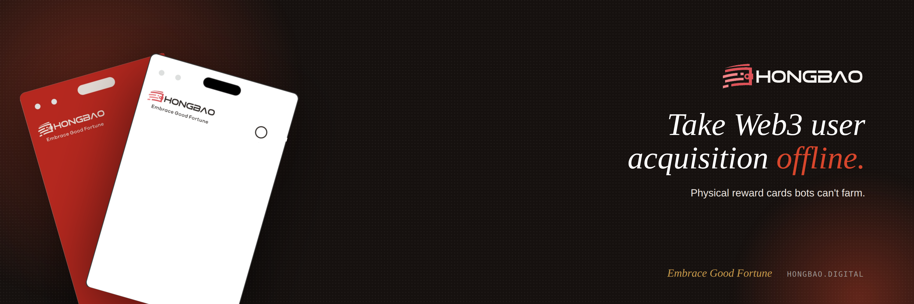

  

# Hongbao Documentation

**Hold the card, own the assets. Sign, and it's claimed.**

Hongbao (红包) is the Chinese red packet — hand it over, and the money inside belongs to whoever received it, no third party's approval required. The Hongbao protocol brings that gesture on-chain. It's an on-chain asset-distribution protocol in the shape of a physical card: the secure element inside each card generates a secp256k1 key at the factory and seals it forever, and the matching on-chain address holds the assets. Hand someone the card, and the value is theirs — non-custodially, with no account, no activation code, and no freeze risk. Cards can also carry tasks, unlocking more for each action a holder completes. Hongbao never touches the funds: the entire flow lives on-chain and the issuer controls their own money throughout.

## Read the docs

| Language | Start here |
|---|---|
| **English** | [English documentation →](EN/README.md) |
| **中文** | [中文文档 →](CN/README.md) |

## Quick links

| | English | 中文 |
|---|---|---|
| Received a card? | [Before you claim](EN/receiver/overview.md) | [领取前了解](CN/receiver/overview.md) |
| Want to distribute assets? | [Issuer overview](EN/issuer/overview.md) | [发卡方概览](CN/issuer/overview.md) |
| Security model | [Security model](EN/security.md) | [安全模型](CN/security.md) |
| Glossary | [Glossary](EN/glossary.md) | [术语表](CN/glossary.md) |

- **Source code:** [github.com/hongbao-labs/contracts](https://github.com/hongbao-labs/contracts)
- **Privacy policy:** [hongbao.digital/#/privacy](https://hongbao.digital/#/privacy)
- **Contact:** [English](EN/contact.md) · [中文](CN/contact.md)

> *Embrace Good Fortune. 拥抱好运。*
